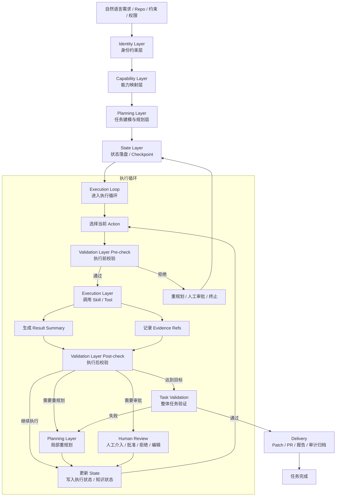
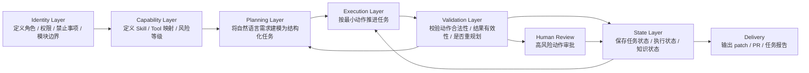
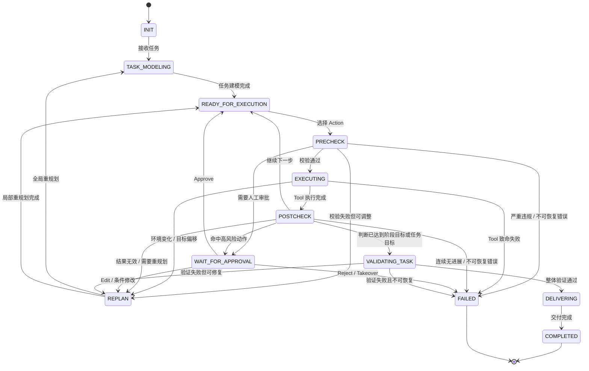
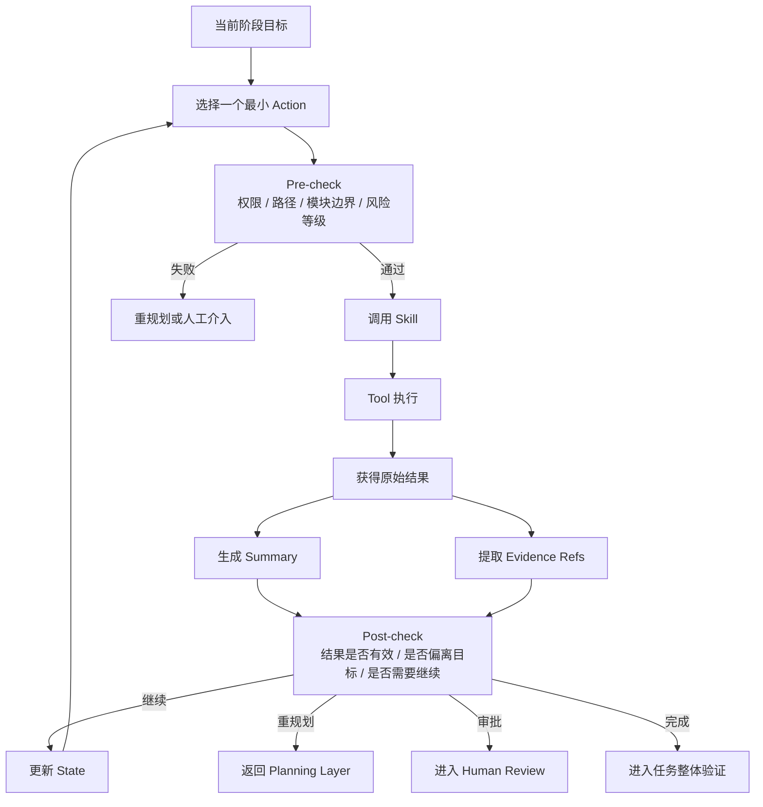

# Agent Pipeline V2：工业级代码 Agent 执行框架设计文档

## 1. 文档目的

本文档定义一套面向**工业级代码生成与修改场景**的 Agent Pipeline。该 Pipeline 的目标不是单纯让 Agent 能够连续调用工具、生成代码，而是让 Agent 在真实工程环境中具备如下能力：

- 能够理解自然语言需求并转化为结构化任务
- 能够在受限边界内自主规划和执行动作
- 能够通过工具链完成代码读取、修改、验证与交付
- 能够在长任务中保持状态一致、支持恢复与接管
- 能够对高风险动作施加约束、审批和审计
- 能够以结构化方式沉淀执行过程，支持优化与复盘

因此，本设计的核心目标不是“让 Agent 更像人”，而是“让 Agent 成为一个可控、可治理、可恢复、可迭代的任务执行系统”。

------

## 2. 设计原则

整个 Agent Pipeline 设计遵循以下原则：

### 2.1 身份先于动作

Agent 的行为必须先被角色、目标、权限和边界定义，再进入具体执行。系统首先约束“我是谁、我能做什么、我不能做什么”，然后才讨论“我要怎么做”。

### 2.2 技能不是函数列表，而是能力单元

Skill 不应只是一个函数名或工具名，而应是一个具备用途说明、触发条件、输入输出格式、风险等级和副作用描述的能力单元。这样 Agent 调用 Skill 时，才不是机械选择工具，而是在能力空间中进行合理决策。

### 2.3 计划与执行分层

任务理解与任务执行属于不同类型的推理。前者负责建模问题，后者负责推进动作。系统应避免将“理解需求”“制定计划”“执行工具”“解释结果”混杂在同一轮上下文中。

### 2.4 任何执行都必须可验证

Agent 不是想到什么就做什么。每一个动作在进入执行前都应经过策略检查，在执行后都应经过结果验证。系统必须能回答：这一步是否合法、是否有效、是否满足边界约束。

### 2.5 Summary 不能替代 Evidence

为了压缩上下文，可以对每一步生成摘要，但摘要只适合承载“决策信息”，不能取代原始证据。系统必须同时保留证据引用，以支持后续回看、重规划、审计和人工介入。

### 2.6 流水线优先于一次性聪明

工业级 Agent 不追求一次性做对所有事，而追求持续推进、可回滚、可中断、可接管。系统更应像一条受控流水线，而不是一个自由发挥的对话体。

------

## 3. 整体目标

本 Pipeline 主要面向以下任务场景：

- 代码修改
- Bug 修复
- 小范围重构
- 补充测试
- 配置变更
- 文档与实现同步更新
- 在受限范围内的跨文件改动

本 Pipeline 不默认支持以下高风险或高不确定性场景，除非额外增加治理机制：

- 无边界的大规模架构重构
- 直接操作生产系统
- 数据迁移和不可逆修改
- 自主更改核心模块依赖关系
- 无审批的外部系统写入操作

------

## 4. 分层架构

整个 Agent Pipeline 建议拆分为六层，每一层负责不同的职责。

### 4.1 Identity Layer（身份约束层）

这一层定义 Agent 的系统级身份，是整个 Pipeline 的上层约束入口。

#### 主要职责

- 定义 Agent 的角色
- 定义任务目标类型
- 定义禁止事项
- 定义权限边界
- 定义模块边界
- 定义输出风格和行为规范

#### 它解决的问题

- Agent 不知道自己的职责范围
- Agent 会越过不该修改的边界
- Agent 会为了完成目标而采取不可接受的手段

#### 示例

- 你是一个代码修改 Agent，只能在指定仓库中进行受限修改
- 禁止创建新的跨模块依赖
- 禁止修改未授权目录
- 禁止直接执行删除操作，除非进入人工审批

这一层回答的问题是：

**我是谁，我可以做什么，我绝不能做什么。**

------

### 4.2 Capability Layer（能力映射层）

这一层定义 Agent 拥有哪些 Skill，以及 Skill 和底层 Tool 之间的映射关系。

#### 主要职责

- 管理 Skill 索引
- 描述每个 Skill 的用途
- 定义每个 Skill 的适用场景
- 定义输入输出 Schema
- 定义风险等级与副作用
- 将 Skill 映射到 Tool 或 Tool 组合

#### 它解决的问题

- Tool 太底层，Agent 难以直接正确选择
- Agent 不知道什么时候该用哪个工具
- 相同工具在不同场景下语义不同，容易误用

#### Skill 设计建议

每个 Skill 至少应包含：

- `skill_name`
- `purpose`
- `when_to_use`
- `input_schema`
- `constraints`
- `risk_level`
- `side_effect`
- `tool_mapping`
- `output_schema`

#### 示例

```json
{
  "skill_name": "ReadLocalSourceFiles",
  "purpose": "读取指定工作区内的源码文件",
  "when_to_use": [
    "确认函数实现",
    "查看接口定义",
    "理解模块行为"
  ],
  "input_schema": {
    "files": "string[]"
  },
  "constraints": [
    "只能读取授权目录下文件",
    "禁止读取敏感配置目录"
  ],
  "risk_level": "low",
  "side_effect": "none",
  "tool_mapping": ["Read_File"],
  "output_schema": {
    "contents": "file_contents[]"
  }
}
```

这一层回答的问题是：

**我有哪些手段，每种手段适用于什么场景。**

------

### 4.3 Planning Layer（任务建模与规划层）

这一层对应任务进入执行前的理解与建模过程。它不负责立即执行工具，而负责把自然语言需求转化为结构化任务模型。

#### 主要职责

- 解析自然语言需求
- 生成任务摘要
- 提取约束条件
- 识别影响范围
- 生成全局计划骨架
- 定义当前阶段目标
- 输出下一步候选动作

#### 它解决的问题

- 原始需求表达不完整或模糊
- 任务没有边界和成功标准
- 后续执行没有路线图

#### 输出建议

Planning Layer 的输出建议包含：

- `task_summary`
- `goal`
- `constraints`
- `affected_scope`
- `success_criteria`
- `global_plan`
- `current_phase`
- `next_actions`
- `risk_points`

#### 示例

```json
{
  "task_summary": "调整页面主题颜色",
  "goal": "将系统主色从蓝色切换为绿色，并保持整体样式一致",
  "constraints": [
    "不得修改业务逻辑",
    "不得新增跨模块依赖"
  ],
  "affected_scope": [
    "ui/theme",
    "ui/components"
  ],
  "success_criteria": [
    "主题色生效",
    "构建通过",
    "样式回归检查通过"
  ],
  "global_plan": [
    "识别主题配置来源",
    "定位主色调用点",
    "修改样式定义",
    "执行构建与验证"
  ],
  "current_phase": "context_discovery",
  "next_actions": [
    {
      "action_type": "read_file",
      "target": "src/theme/theme_config.ts"
    },
    {
      "action_type": "search_code",
      "target": "primaryBlue"
    }
  ],
  "risk_points": [
    "颜色常量可能分散在多个组件中"
  ]
}
```

#### 重要原则

Planning Layer 不建议一次性规划出过深、过满的完整执行流程。更推荐输出：

- 任务骨架
- 当前阶段目标
- 下一步最小动作集

因为真实执行中，随着文件读取、工具反馈、测试结果变化，计划往往需要动态修正。

这一层回答的问题是：

**这个任务是什么，接下来该往哪走，当前最该做什么。**

------

### 4.4 Execution Layer（动作执行层）

这一层负责真正把计划转化为可执行动作。它以循环方式运行，每次只处理一个或少量最小动作单元。

#### 主要职责

- 选择当前 Action
- 准备 Action 参数
- 调用对应 Skill / Tool
- 获取执行结果
- 记录中间状态
- 生成动作摘要
- 决定下一步走向

#### 它解决的问题

- 计划不能直接产生结果，必须落到具体动作
- Agent 需要通过外部工具与真实工程环境交互
- 长任务需要按步骤推进，而不是一口气生成完整答案

#### 单轮执行建议结构

每一次 Action Execution 应至少包含：

- `step_id`
- `current_goal`
- `action`
- `policy_check`
- `execution_result`
- `result_summary`
- `evidence_refs`
- `next_decision`

#### 示例

```json
{
  "step_id": 3,
  "current_goal": "确认主色定义位置",
  "action": {
    "tool": "Read_File",
    "params": {
      "path": "src/theme/theme_config.ts"
    }
  },
  "policy_check": {
    "allowed": true,
    "risk_level": "low"
  },
  "execution_result": {
    "status": "success"
  },
  "result_summary": "确认主色定义为 primaryBlue，关联按钮和导航栏样式",
  "evidence_refs": [
    {
      "path": "src/theme/theme_config.ts",
      "lines": "12-38"
    }
  ],
  "next_decision": "继续搜索 primaryBlue 的调用点"
}
```

#### Action 设计建议

Action 不应过粗，也不应过碎。推荐遵循“单步有意义、单步可验证”的原则。例如：

- 合理：读取 1~3 个相关文件
- 合理：搜索一个关键符号的所有引用
- 合理：修改一个局部文件并保存 patch
- 不合理：一次性对整个仓库做所有修改
- 不合理：把读取、分析、修改、验证混在一个动作里

这一层回答的问题是：

**如何把计划转化为受控动作，并推进任务。**

------

### 4.5 Validation Layer（验证与策略控制层）

这一层是整个 Pipeline 中极其关键但常被忽略的一层。它位于“思考”和“执行”之间，也位于“执行”和“继续推进”之间。

#### 主要职责

- 检查 Action 是否符合权限与边界
- 检查执行结果是否满足预期
- 检查是否违反模块隔离规则
- 检查是否需要重规划
- 检查是否需要人工介入
- 检查是否超出预算或迭代上限

#### 它解决的问题

- Agent 思考出的动作不一定都能执行
- Agent 做出的结果不一定都应被接受
- 没有验证层，系统很容易越权、失控或陷入无效循环

#### Validation Layer 的两个方向

##### 1）执行前校验（Pre-check）

在动作真正执行前，检查：

- 是否在允许目录内
- 是否符合模块访问规则
- 是否属于允许 Skill
- 是否需要审批
- 是否存在参数风险

##### 2）执行后校验（Post-check）

在动作完成后，检查：

- 结果是否成功
- 输出是否符合 schema
- 修改是否符合目标
- 是否需要继续、重试或重规划
- 是否违反架构或依赖约束

#### 模块隔离建议

像“A 模块不能依赖 B 模块”这样的规则，不应只写在系统提示词中，而应该进入 Validation Layer，变成机器可执行检查，包括：

- 修改前校验目标路径是否属于授权模块
- 修改后检查 import/include 变化
- 在验证阶段运行 dependency rule checker
- 对违规 patch 直接拒绝或打回重规划

这一层回答的问题是：

**刚才那一步能不能做、做得算不算数、是否还能继续。**

------

### 4.6 State Layer（状态与记忆层）

这一层贯穿整个 Pipeline，负责保存任务进行到哪里、为什么走到这里、接下来应该如何恢复或继续。

#### 主要职责

- 保存任务整体状态
- 保存每一步执行记录
- 保存决策摘要
- 保存证据引用
- 保存失败和重试信息
- 支持中断恢复
- 支持人工接管与审计回放

#### 它解决的问题

- 长流程任务不能只靠对话历史驱动
- 失败后不能从零开始
- 摘要压缩会丢失原始信息
- 人工介入时必须知道上下文和依据

#### 状态建议分三类

##### 1）任务状态（Task State）

描述任务本身：

- 任务摘要
- 目标
- 约束
- 当前阶段
- 成功标准
- 风险点

##### 2）执行状态（Execution State）

描述任务已经做到哪一步：

- 已执行动作
- 当前动作
- 动作结果
- 失败次数
- 重试历史
- 当前 budget 使用情况

##### 3）知识状态（Knowledge State）

描述任务中沉淀的认知与证据：

- 动作摘要
- 关键发现
- 代码证据引用
- 测试结果引用
- patch 位置

#### 状态结构示例

```json
{
  "task_id": "task_001",
  "task_state": {
    "task_summary": "调整页面主题颜色",
    "goal": "主色从蓝色切换为绿色",
    "current_phase": "implementation",
    "constraints": [
      "不得修改业务逻辑",
      "不得新增跨模块依赖"
    ]
  },
  "execution_state": {
    "step_id": 5,
    "completed_actions": ["read_theme_file", "search_color_refs"],
    "retry_count": 1
  },
  "knowledge_state": {
    "summaries": [
      "theme_config.ts 中定义了主色 primaryBlue",
      "Button 和 Navbar 使用了 primaryBlue"
    ],
    "evidence_refs": [
      {
        "path": "src/theme/theme_config.ts",
        "lines": "12-38"
      },
      {
        "path": "src/components/Button.tsx",
        "lines": "9-25"
      }
    ]
  }
}
```

这一层回答的问题是：

**系统现在走到哪了，基于什么信息走到这里，如何继续。**

------

## 5. 推荐执行时序

建议整条 Pipeline 按如下时序运行：

### 步骤 1：接收任务

系统接收自然语言需求、上下文信息、目标仓库、权限范围和外部约束。

### 步骤 2：加载身份约束

根据系统级描述符，载入 Agent 的角色、禁止事项、模块边界和任务行为约束。

### 步骤 3：加载能力索引

加载可用 Skill 列表，构建本次任务允许使用的能力空间。

### 步骤 4：任务建模

通过 Planning Layer 将自然语言需求转换为结构化任务模型，并生成全局骨架与下一步最小动作集。

### 步骤 5：状态落盘

将任务模型、当前阶段、候选动作、风险点等持久化保存，为后续中断恢复提供基础。

### 步骤 6：进入执行循环

执行循环包含以下子步骤：

1. 从当前阶段选择一个 Action
2. 进入 Validation Layer 做执行前校验
3. 若通过，则调用 Skill / Tool 执行
4. 获取结果并生成 Summary
5. 保留对应 Evidence 引用
6. 进入 Validation Layer 做执行后校验
7. 判断是否进入下一步、重试、重规划或人工介入
8. 更新状态并再次落盘

### 步骤 7：任务验证

当系统判断已经达到目标后，执行整体层面的验证，包括测试、静态检查、依赖规则检查、任务成功标准检查等。

### 步骤 8：进入交付或人工审批

对于需要提交 patch、创建 PR、修改关键配置或执行高风险动作的场景，进入审批流程。审批完成后进入交付。

### 步骤 9：沉淀执行记录

最终输出应包括：

- 任务结果
- 修改摘要
- 验证结果
- 中间状态快照
- 失败与重试记录
- 可复盘的审计链路

------

## 6. 状态机视角下的运行模型

为了避免 TE 循环无限自回归，建议将整个 Pipeline 建模为显式状态机，而不是隐式对话流。

### 推荐状态

- `INIT`
- `TASK_MODELING`
- `READY_FOR_EXECUTION`
- `PRECHECK`
- `EXECUTING`
- `POSTCHECK`
- `REPLAN`
- `WAIT_FOR_APPROVAL`
- `VALIDATING_TASK`
- `DELIVERING`
- `FAILED`
- `COMPLETED`

### 状态迁移示意

- `INIT -> TASK_MODELING`
- `TASK_MODELING -> READY_FOR_EXECUTION`
- `READY_FOR_EXECUTION -> PRECHECK`
- `PRECHECK -> EXECUTING`
- `EXECUTING -> POSTCHECK`
- `POSTCHECK -> READY_FOR_EXECUTION`
- `POSTCHECK -> REPLAN`
- `POSTCHECK -> WAIT_FOR_APPROVAL`
- `POSTCHECK -> VALIDATING_TASK`
- `VALIDATING_TASK -> DELIVERING`
- `DELIVERING -> COMPLETED`
- 任意状态在不可恢复错误下进入 `FAILED`

这样做的好处是：

- 每一步责任明确
- 便于审计和追踪
- 便于持久化和恢复
- 便于人工接管

------

## 7. Summary 与 Evidence 双轨机制

这是本设计中的关键机制之一。

### 7.1 Summary 的作用

Summary 用于压缩上下文，向后续步骤传递“决策必要信息”，例如：

- 发现了什么
- 结论是什么
- 当前建议下一步做什么

### 7.2 Evidence 的作用

Evidence 用于保留“原始依据”，例如：

- 具体文件路径
- 具体代码行号
- 原始日志片段
- 外部工具返回引用
- patch 文件位置

### 7.3 为什么需要双轨

如果只有 Evidence，没有 Summary，则后续推理成本高、上下文膨胀。
如果只有 Summary，没有 Evidence，则：

- 细节丢失
- 结论不可验证
- 人工无法复核
- 重规划时无法回看事实依据

### 7.4 推荐结构

```json
{
  "action_result_summary": "发现 login() 调用了 validateToken()，token 过期路径缺少测试覆盖",
  "evidence_refs": [
    {
      "path": "src/user_service.cpp",
      "lines": "120-168"
    },
    {
      "path": "tests/user_service_test.cpp",
      "lines": "45-78"
    }
  ]
}
```

------

## 8. 失败处理模型

工业级 Pipeline 必须显式定义失败，而不是把失败交给模型自由理解。

### 8.1 常见失败类型

#### 工具失败

- Tool 不可用
- Tool 超时
- Tool 返回格式不合法
- 外部服务不可达

#### 环境失败

- 文件不存在
- 权限不足
- 工作区损坏
- 依赖安装失败

#### 策略失败

- 访问未授权目录
- 触发高风险操作
- 违反模块隔离
- 超预算

#### 执行失败

- 改动后测试失败
- 改动不满足成功标准
- 多轮尝试无进展
- 任务偏离原目标

### 8.2 失败后的处理路径

根据失败类型，系统应选择不同策略：

- **Retry**：适用于瞬时错误，如 Tool 超时
- **Replan**：适用于事实认知发生变化，如文件结构与预期不符
- **Escalate**：适用于权限、风险或高不确定性问题，转人工审批或人工接管
- **Abort**：适用于无法恢复的严重错误

### 8.3 连续无进展保护

必须设置“无进展检测”，例如：

- 连续 N 轮 Summary 高度重复
- 连续 N 轮修改后同一测试仍失败
- 连续 N 次调用不同 Tool 后没有新增有效证据

触发后应进入：

- 重规划
- 等待人工
- 终止任务

------

## 9. 模块隔离与架构约束

模块隔离是工业代码场景中的重要治理要求，不应只靠系统提示词保证。

### 9.1 模块规则来源

可来自：

- 项目架构规则文件
- 依赖规则配置
- 仓库内约定文档
- 手动定义的模块白名单/黑名单

### 9.2 应用时机

模块约束应在三个阶段生效：

#### 规划阶段

在 Planning Layer 中标记允许影响的模块范围

#### 执行前校验阶段

在 Validation Layer 中检查目标文件、目标目录是否属于允许范围

#### 执行后验证阶段

检查 patch 是否引入非法 import/include、是否破坏依赖方向

### 9.3 典型规则示例

- A 模块不能依赖 B 模块
- UI 层不能直接访问数据持久化层
- 测试目录可以依赖源码目录，但反向不允许
- config 目录禁止 Agent 自动写入

------

## 10. 人工介入与审批机制

工业级 Agent 不应追求全自动无边界执行，而应为高风险路径设计人工介入点。

### 10.1 需要人工审批的典型场景

- 删除文件
- 修改核心模块依赖
- 修改 CI/CD 配置
- 改动超出授权目录
- 调用外部写入型 MCP
- 执行数据库迁移
- 推送远程分支或创建 PR

### 10.2 人工介入方式

- Approve：批准继续执行
- Reject：拒绝执行
- Edit：人工调整参数或 patch 后继续
- Takeover：人工接管，停止自动流程

### 10.3 审批时应呈现的信息

- 当前任务摘要
- 待执行动作
- 风险等级
- 影响范围
- 相关证据
- 当前 patch / diff
- 推荐操作

------

## 11. 交付层设计

任务完成不等于任务交付。Pipeline 应在结束时输出一组可工程协作使用的标准结果。

### 11.1 最终产物建议包括

- 任务结果状态
- 修改摘要
- patch / diff
- 影响文件列表
- 验证结果
- 风险说明
- 审批记录
- 失败与重试记录

### 11.2 典型交付形式

- 本地 patch 文件
- Git commit
- Pull Request
- 结构化任务报告
- 审计日志归档

------

## 12. 最小可行版本（MVP）建议

为了降低实现复杂度，建议先构建一个最小可行版本，而不是一开始做成大而全系统。

### MVP 范围建议

先支持以下能力：

- 单仓库
- 单 Agent
- 少量只读和读写 Tool
- 单一任务类型（如小范围代码修改）
- 基础状态落盘
- 基础 Summary + Evidence 保留
- 简单 Pre-check / Post-check
- 人工审批占位点

### MVP 暂时不必实现

- 多 Agent 协作
- 复杂跨仓库任务
- 自动合并 PR
- 高级长期记忆
- 全量策略引擎
- 复杂预算调度系统

------

## 13. 推荐文档结构与配置文件

为了让整个 Pipeline 真正可维护，建议将系统描述、Skill 定义、模块约束和状态 schema 都外置为独立配置。

### 建议文件

- `system_profile.yaml`：系统级身份与约束
- `skills_index.yaml`：Skill 索引定义
- `module_rules.yaml`：模块依赖与隔离规则
- `task_schema.json`：任务模型 schema
- `action_schema.json`：动作模型 schema
- `state_schema.json`：状态模型 schema
- `policy_rules.yaml`：执行策略与审批规则

这样可以将“行为规则”与“执行引擎”解耦，便于迭代和治理。

------

## 14. Mermaid 流程图与状态机图

### 14.1 整体分层与执行流程图



### 14.2 Layer 视角下的职责流程图



### 14.3 状态机状态图



### 14.4 执行循环细化图



## 15. 结论

本设计将 Agent Pipeline 从“会连续调用工具的智能体”提升为“可控的任务执行框架”。

其核心思想不是增强 Agent 的自由度，而是通过明确分层来增强系统的可控性。整个框架由以下六层构成：

- Identity Layer：定义身份、目标、边界
- Capability Layer：定义能力、Skill 与 Tool 映射
- Planning Layer：将自然语言建模为结构化任务
- Execution Layer：按最小动作推进任务
- Validation Layer：校验合法性、有效性和风险
- State Layer：保存状态、摘要、证据与恢复点

这六层共同组成一个受控循环：

**任务建模 -> 动作选择 -> 策略校验 -> 工具执行 -> 结果验证 -> 状态更新 -> 继续推进 / 重规划 / 审批 / 交付**

如果说普通 Agent 的核心问题是“能不能做事”，那么工业级 Agent Pipeline 的核心问题是：

**能不能在边界清晰、状态可靠、结果可验、风险可控的前提下持续做对事。**

这正是本设计文档要解决的问题。